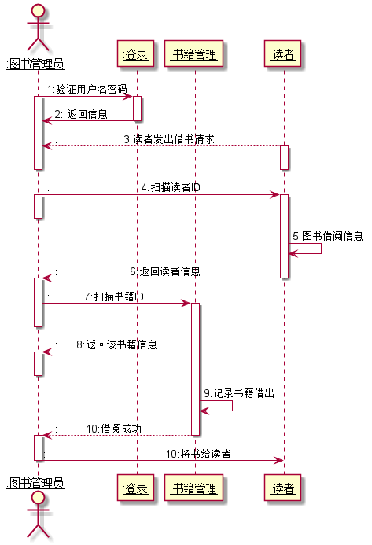
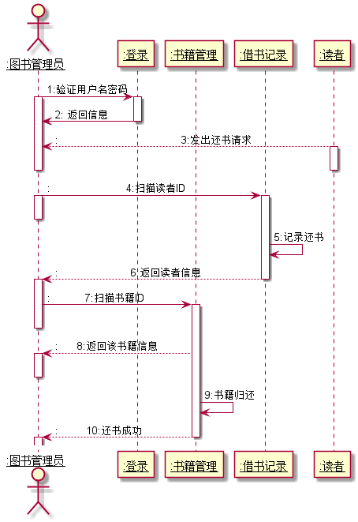

# 实验4：图书管理系统顺序图绘制
|学号|班级|姓名|
|:-------:|:-------------: | :----------:|
|201510414414|软件4|倪果|

## 图书管理系统的顺序图

## 1. 借书用例
## 1.1. 借书用例PlantUML源码

``` sequence
@startuml
actor "<u:black>:图书管理员</u>" as 图书管理员
participant "<u:black>:登录</u>" as A
participant "<u:black>:书籍管理</u>" as B
participant "<u:black>:读者</u>" as C


图书管理员 -> A: 1:验证用户名密码
activate 图书管理员
activate A
A->图书管理员: 2: 返回信息
deactivate A

C -->图书管理员::                     3:读者发出借书请求
activate C
deactivate C
deactivate 图书管理员
图书管理员 -> C::                             4:扫描读者ID
activate 图书管理员
deactivate 图书管理员
activate C
C->C:5:图书借阅信息
C -->图书管理员::                       6:返回读者信息
deactivate C
activate 图书管理员
图书管理员 -> B::           7:扫描书籍ID
activate B
deactivate 图书管理员
B-->图书管理员::      8:返回该书籍信息

activate 图书管理员
deactivate 图书管理员

B->B:9:记录书籍借出
B-->图书管理员::         10:借阅成功
deactivate B

activate 图书管理员
图书管理员 ->C::                                      10:将书给读者
deactivate 图书管理员

@enduml
```

## 1.2. 借书用例顺序图


## 1.3. 借书用例顺序图说明
ABCDE....

***

## 2. 还书用例
## 2.1. 还书用例PlantUML源码

``` sequence
@startuml
actor "<u:black>:图书管理员" as 图书管理员
participant "<u:black>:登录" as A
participant "<u:black>:书籍管理" as B
participant "<u:black>:借书记录" as C
participant "<u:black>:读者" as D

图书管理员 -> A: 1:验证用户名密码
activate 图书管理员
activate A
A->图书管理员: 2: 返回信息
deactivate A

D -->图书管理员::                                       3:发出还书请求
activate D
deactivate D
deactivate 图书管理员
图书管理员 -> C::                        4:扫描读者ID
activate 图书管理员
deactivate 图书管理员
activate C
C->C:5:记录还书
C -->图书管理员::                       6:返回读者信息
deactivate C
activate 图书管理员
图书管理员 -> B::           7:扫描书籍ID
activate B
deactivate 图书管理员
B-->图书管理员::      8:返回该书籍信息

activate 图书管理员
deactivate 图书管理员

B->B:9:书籍归还

B-->图书管理员::         10:还书成功

deactivate B
activate 图书管理员
deactivate 图书管理员
@enduml
```

## 2.2. 还书用例顺序图


## 2.3. 还书用例顺序图说明
ABCDE...
***