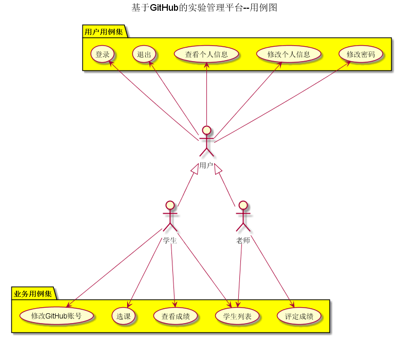

# 基于GitHub的实验管理平台的分析与设计

|学号|班级|姓名|
|:-------:|:-------------: | :----------:|
|201510414414|软件(本)15-4|倪果|

## 1. 概述
- 基于GitHub的实验管理平台的作用是在线管理实验成绩的Web应用系统。学生和老师的实验内容均存放在GitHUB页面上。
- 学生的功能主要有：一是修改个人信息（GitHub账号），二是查询自己的实验成绩（每个实验详细得分点），三是学生在登录后，可以选择当前学期进行选课。
- 老师的功能主要有：一是批改每个学生的成绩，学生的实验成绩有多个得分项目组成。二是查看每个学生的成绩。
- 老师和学生都能通过本系统的链接方便地跳转到学生的每个GitHUB实验目录，以便批改实验或者查看实验情况。
- 实验成绩按数字分数计算，每项实验的满分为100分，最低为0分。最终实验分数由多个得分点组成。
- 最终系统自动计算每个学生的所有实验的平均分。

## 2. 系统总体结构

实验管理平台详细界面设计参见：https://worldghost.github.io/is_analysis/test6/UI/index.html
    
## 3. 用例图设计 [源码](./src/useCase.puml)

## 4. 类图设计 [源码](./src/class.puml)

## 5. 数据库设计 
- ### [参见详情](./dataBaseDesign.md)
     
## 6. 用例及界面详细设计    
- ### [“学生列表”用例](./useCase/学生列表.md),[界面](https://worldghost.github.io/is_analysis/test6/UI/index.html)
- ### [“登录”用例](./useCase/登录.md),[界面](https://worldghost.github.io/is_analysis/test6/UI/login.html)
- ### [“选择学期”用例](./useCase/选择学期.md),[界面](https://worldghost.github.io/is_analysis/test6/UI/haslogin.html)
- ### [“选课”用例](./useCase/选课.md),[界面](https://worldghost.github.io/is_analysis/test6/UI/selectcourse.html)
- ### [“评定成绩”用例](./useCase/评定成绩.md),[界面](https://worldghost.github.io/is_analysis/test6/UI/evaluationresults.html)
- ### [“查看成绩”用例](./useCase/查看成绩.md),[界面](https://worldghost.github.io/is_analysis/test6/UI/listscore.html)
- ### [“查看个人信息”用例](./useCase/查看个人信息.md),[界面](https://worldghost.github.io/is_analysis/test6/UI/personinfo.html)
- ### [“修改密码”用例](./useCase/修改密码.md),[界面](https://worldghost.github.io/is_analysis/test6/UI/changepassword.html)
- ### [“修改个人信息”用例](./useCase/修改个人信息.md),[界面](https://worldghost.github.io/is_analysis/test6/UI/changeinfo.html)
- ### [“退出”用例](./useCase/退出.md),[界面](https://worldghost.github.io/is_analysis/test6/UI/haslogin.html)

## 7. 参考文献
- 基于GitHub的实验管理平台参考：https://github.com/zwdbox/is_analysis/tree/master/test6
