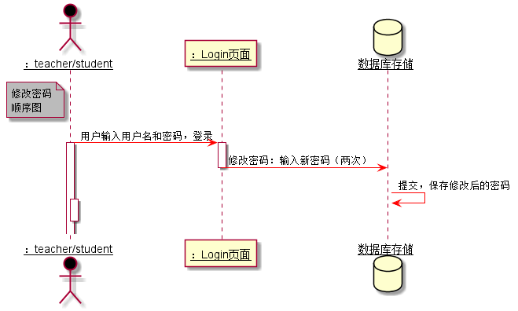

# “修改密码”用例 [返回](../README.md)
## 1. 用例规约

|用例名称|修改密码|
|-------|:-------------|
|功能|修改用户的密码|
|参与者|学生，老师|
|前置条件|必须先登录|
|后置条件|修改密码以后会退出，再跳转到登录页面，进行重新登录|
|主事件流| 1.用户填写新密码（两次输入）   2.提交  3.系统保存修改后的密码|
|备选事件流|1.用户两次输入的密码不同，修改失败  2.系统提示两次输入的密码不相同   3.用户重新填写并提交。 |

## 2. 业务流程  [源码](../修改密码顺序图.puml)
 

## 3. 界面设计
- 界面参照:https://worldghost.github.io/is_analysis/test6/UI/changepassword.html
- API接口调用
    - 接口1：[setPassword](../interface/setPassword.md)

## 4. 算法描述
无
    
## 5. 参照表
users
- [USERS](../dataBaseDesign.md/#USERS)
