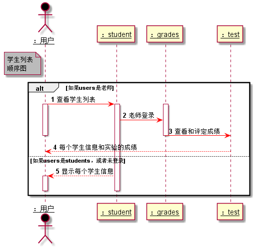

# “学生列表”用例 [返回](../README.md)
## 1. 用例规约

|用例名称|学生列表|
|-------|:-------------|
|功能|以表形式的显示出所有学生的信息|
|参与者|游客，学生，老师|
|前置条件|学生，老师需登录才能进行某些操作|
|后置条件| |
|主事件流| 1.显示学号，班级，姓名等个人信息 2.修改GitHub账号（学生登录） 3.评定成绩（老师登录）|
|备选事件流|必须是登录状态下，否则操作无效 |

## 2. 业务流程（顺序图） [源码](../学生列表顺序图.puml)
 

## 3. 界面设计
- 界面参照: https://worldghost.github.io/is_analysis/test6/UI/index.html

## 4. 算法描述
无
## 5. 参照表

- [STUDENTS](../dataBaseDesign.md/#STUDENTS)
- [GRADES](../dataBaseDesign.md/#GRADES)
- [TESTS](../dataBaseDesign.md/#TESTS)

