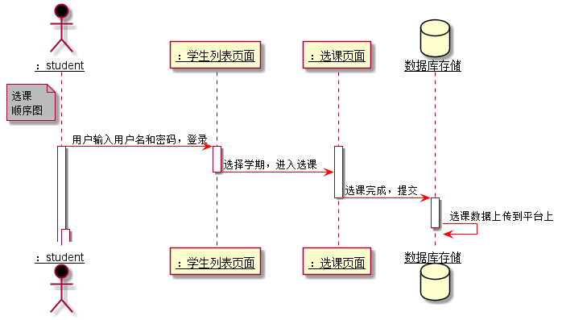

# “选课”用例 [返回](../README.md)
## 1. 用例规约

|用例名称|选课|
|-------|:-------------|
|功能|学生登录后可以选择该学期课程|
|参与者|学生|
|前置条件|学生需要先登录|
|后置条件| |
|主事件流| 1.学生选择5门或以上课程 2.课程之间最好不要时间冲突|
|备选事件流| |

## 2. 业务流程（顺序图） [源码](../选课顺序图.puml)
 

## 3. 界面设计
- 界面参照: https://worldghost.github.io/is_analysis/test6/UI/selectcourse.html

## 4. 算法描述
    无
    
## 5. 参照表
- [COURSE](../dataBaseDesign.md/#COURSE)
